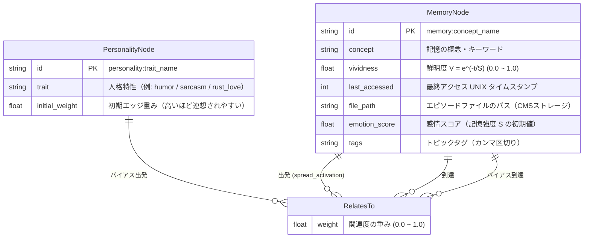

# ER 図: 記憶グラフ スキーマ

## 概要
SurrealDB 上で管理される記憶ノードと、その関係性（エッジ）のスキーマを示します。
README 2.4 のハイブリッド・ストレージ設計に基づき、SurrealDB には**メタデータのみ**を保存します。

## 図

## 備考
- `vividness` はエビングハウス忘却曲線 $V = e^{-t/S}$ に基づき時間とともに減衰する。
- `spread_activation` により、アクセスされたノードの隣接ノードが自動的に鮮明度を加算される。
- `PersonalityNode` のエッジ重みを高く設定することで、連想方向に「Rusty」な人格バイアスをかける。
- `file_path` に実際のエピソードテキストへの参照（CMS構造: `/var/iris/memories/YYYY/MM/DD/`）を格納する。

## Rust 実装との対応
| ER要素 | Rust 実装 |
|---|---|
| `MemoryNode` | `src/memory/graph.rs` の `MemoryNode` 構造体 |
| `RelatesTo` | `src/memory/graph.rs` の `RelatesTo` 構造体 |
| `spread_activation` | `src/memory/graph.rs` の `spread_activation()` 関数 |

## 更新履歴
| 日付 | 変更内容 |
|---|---|
| 2026-03-24 | 初版作成（基本スキーマ） |
| 2026-03-24 | CMSアーキテクチャ対応・PersonalityNode追加・Rust実装との対応表追記 |
