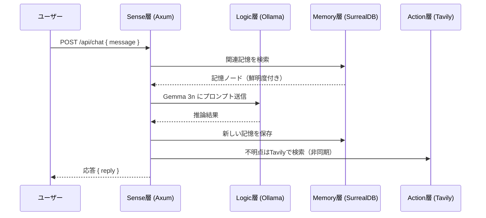
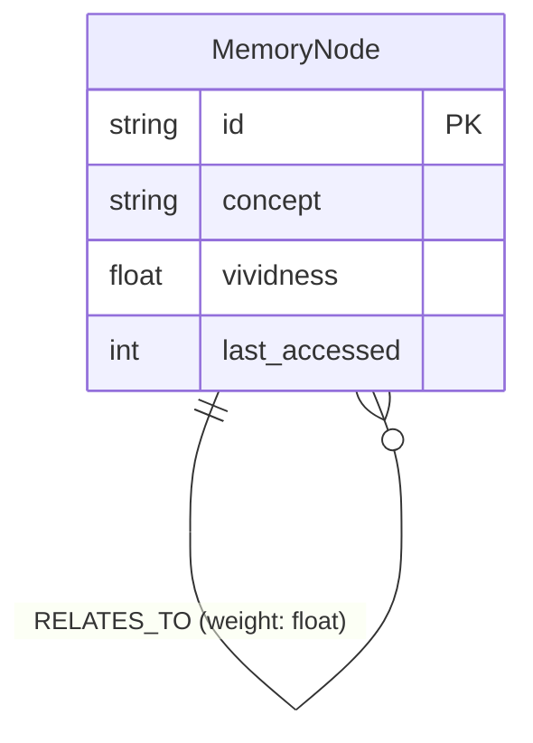

# ドキュメント作成規約: Project I.R.I.S.

このファイルは、`.gemini/docs/` 配下に作成するドキュメントの種類・形式・命名規則を定義します。

---

## 🔑 大原則：「実態を元に作成する」

> [!IMPORTANT]
> **すべてのドキュメント・図・仕様書は、実際に実装済みのコードを正確に反映したものでなければならない。**

- **❌ 禁止**: 将来実装する予定の機能や、まだ存在しないエンドポイントをドキュメント化すること。
- **✅ 推奨**: 実装完了を確認してから、そのコードを読んでドキュメントを作成する。
- **⏱ タイミング**: ドキュメントは実装の**直後**に作成すること。「あとでまとめて書く」は禁止。
- **🔍 正確性の確認**: 図や仕様書を作成する前に、必ず対象の `src/` 配下のコードを読み、実際の構造・シグネチャ・フローを確認すること。
- **🔄 乖離の検出**: ドキュメントの内容と実際のコードが乖離していることを発見した場合は、ドキュメントを即座に更新すること（コードが正、ドキュメントが従）。

---

## 📁 ディレクトリ構成ルール

```
.gemini/docs/
├── architecture.md           # システム全体アーキテクチャ（必須）
├── diagrams/                 # Mermaid 図を含むドキュメント群
│   ├── sequence_*.md         # シーケンス図（API・処理フロー）
│   ├── class_*.md            # クラス・データ構造図
│   ├── flowchart_*.md        # フローチャート（判断ロジック等）
│   └── er_*.md               # エンティティ関係図（DBスキーマ等）
└── api/                      # OpenAPI 仕様書
    └── openapi.yaml          # OpenAPI 3.1 仕様書（メイン）
```

---

## 📊 Mermaid 図 作成ルール

### 基本方針
- **新しいAPIエンドポイント・処理フローを実装したら、対応するシーケンス図を必ず作成すること。**
- **DBスキーマ変更時には ER 図を更新すること。**
- 図はすべて `.gemini/docs/diagrams/` 配下に Markdown ファイルとして保存する。

### シーケンス図（例: `/api/chat` フロー）

````markdown

````

### ER 図（例: 記憶グラフ）

````markdown

````

### 命名規則
| 図の種類 | ファイル名プレフィックス | 例 |
|---|---|---|
| シーケンス図 | `sequence_` | `sequence_chat_flow.md` |
| クラス図 | `class_` | `class_memory_node.md` |
| フローチャート | `flowchart_` | `flowchart_activation.md` |
| ER図 | `er_` | `er_memory_graph.md` |

---

## 📋 OpenAPI 仕様書 作成ルール

### 基本方針
- **Axum に新しいルートを追加したら、`api/openapi.yaml` を必ず更新すること。**
- 仕様書は **OpenAPI 3.1** 形式で記述する。
- すべての `summary` / `description` は**日本語**で記述すること。
- リクエスト・レスポンスのスキーマは必ず `components/schemas` に定義し、`$ref` で参照すること。

### テンプレート

```yaml
openapi: 3.1.0
info:
  title: Project I.R.I.S. API
  description: |
    I.R.I.S.（Ingenious Rusty Intelligent System）のバックエンド API 仕様書。
    Raspberry Pi 5 上で稼働する自律型 AI パートナーとの通信インターフェース。
  version: 0.1.0

servers:
  - url: http://localhost:3000
    description: ローカル開発環境

paths:
  /health:
    get:
      summary: ヘルスチェック
      description: サーバーの稼働状態を確認する。
      responses:
        '200':
          description: 稼働中
          content:
            text/plain:
              schema:
                type: string

  /api/chat:
    post:
      summary: 対話エンドポイント
      description: ユーザーからのメッセージを受け取り、I.R.I.S. の応答を返す。
      requestBody:
        required: true
        content:
          application/json:
            schema:
              $ref: '#/components/schemas/ChatRequest'
      responses:
        '200':
          description: 応答成功
          content:
            application/json:
              schema:
                $ref: '#/components/schemas/ChatResponse'

components:
  schemas:
    ChatRequest:
      type: object
      required: [message]
      properties:
        message:
          type: string
          description: ユーザーからのメッセージ
          example: "今日の天気を教えて"

    ChatResponse:
      type: object
      properties:
        reply:
          type: string
          description: I.R.I.S. からの応答テキスト
          example: "少し回路がサビついていますが……今日は晴れの予報ですよ！"
```

---

## ✅ ドキュメント更新チェックリスト

実装作業の PR を出す前に以下を確認すること：

- [ ] 新規 API エンドポイントの `openapi.yaml` 更新
- [ ] 新規処理フローのシーケンス図作成
- [ ] DBスキーマ変更時の ER 図更新
- [ ] `architecture.md` への影響がある場合は更新
