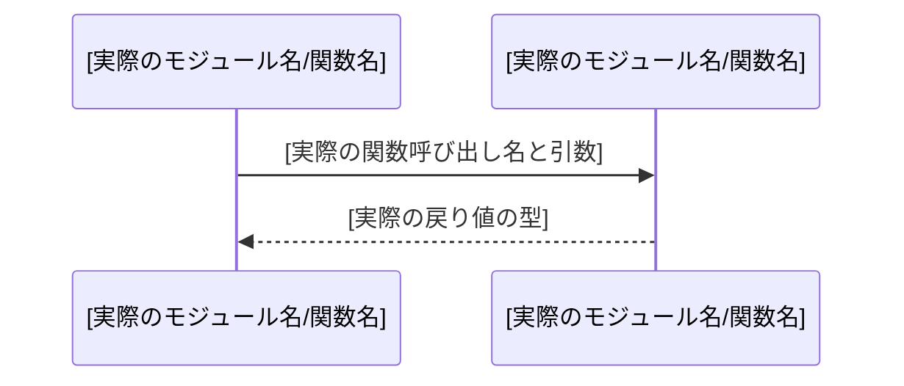

# Mermaid 図作成スキル

> [!IMPORTANT]
> **このスキルはコードを読んでから実行すること。実際のコードを参照せずに図を作成してはならない。**

## 実行手順

### 1. 対象コードの確認（必須）
図を作成する前に、必ず以下のコードを `view_file` で読み込むこと：

| 図の種類 | 読むべきファイル |
|---|---|
| シーケンス図 | 対象の `src/` 配下のハンドラ・サービス関数 |
| ER図 | `src/memory/graph.rs` のスキーマ定義構造体 |
| フローチャート | 対象の条件分岐ロジックを含む関数 |
| クラス図 | 対象の `struct` / `trait` / `impl` 定義 |

### 2. 図の作成
コードを読んだあと、実際の関数呼び出し順・構造体フィールド・フローを元に図を作成する。

**シーケンス図の記述パターン:**


**ER図の記述パターン:**
```mermaid
erDiagram
    [実際の構造体名] {
        [型] [実際のフィールド名] [PK/FK]
    }
    [構造体A] ||--o{ [構造体B] : "[実際のリレーション名]"
```

### 3. ファイルへの保存
- 保存先: `.gemini/docs/diagrams/`
- 命名規則: `sequence_*.md` / `er_*.md` / `flowchart_*.md` / `class_*.md`
- ファイルには「概要」「図」「更新履歴」セクションを必ず含めること

### 4. 乖離チェック
既存の図ファイルを更新する場合は、古い記述と実際のコードを照合し、不一致があれば修正してから保存すること。

## ❌ やってはいけないこと
- コードを読まずに想像で図を作成する
- まだ実装されていない機能を図に含める
- 実際の関数名・型名と異なる名称を使用する
