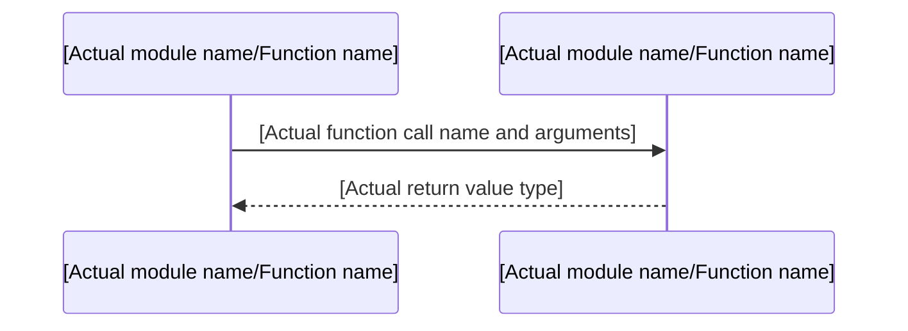

# Mermaid Diagram Creation Skill

> [!IMPORTANT]
> **This skill must be executed after reading the code. Do not create diagrams without referencing the actual code.**

## Execution Procedures

### 1. Verification of Target Code (Mandatory)
Before creating a diagram, always load the following code with `view_file`:

| Type of Diagram | Files to Read |
|---|---|
| Sequence Diagram | Handler/Service functions under the target `src/` |
| ER Diagram | Schema definition structs in `src/memory/graph.rs` |
| Flowchart | Functions containing the target conditional branch logic |
| Class Diagram | Target `struct` / `trait` / `impl` definitions |

### 2. Creation of Diagrams
After reading the code, create diagrams based on the actual function call order, struct fields, and flow.

**Sequence Diagram Description Pattern:**


**ER Diagram Description Pattern:**
```mermaid
erDiagram
    [Actual struct name] {
        [Type] [Actual field name] [PK/FK]
    }
    [Struct A] ||--o{ [Struct B] : "[Actual relation name]"
```

### 3. Saving to File
- Destination: `.gemini/docs/diagrams/`
- Naming Convention: `sequence_*.md` / `er_*.md` / `flowchart_*.md` / `class_*.md`
- Always include "Overview", "Diagram", and "Update History" sections in the file.

### 4. Divergence Check
When updating an existing diagram file, check the old description against the actual code, and if there is a mismatch, fix it before saving.

## ❌ Prohibited Actions
- Creating diagrams based on imagination without reading the code.
- Including features that have not yet been implemented in diagrams.
- Using names different from the actual function names and type names.
