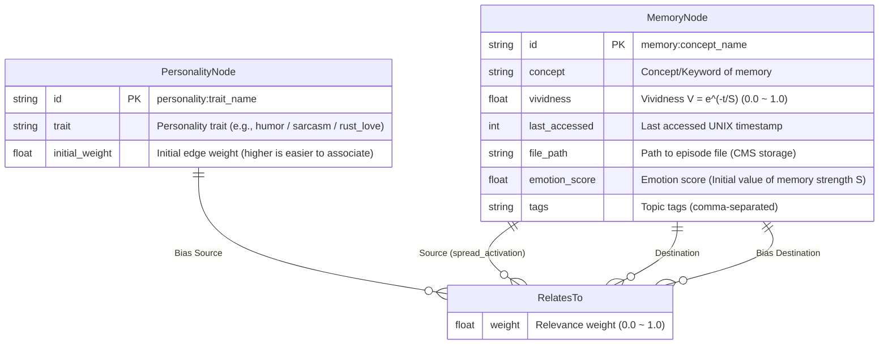

# ER Diagram: Memory Graph Schema

## Overview
Shows the schema of memory nodes and their relationships (edges) managed on SurrealDB.
Based on the hybrid storage design in README 2.4, **only metadata** is stored in SurrealDB.

## Diagram

## Notes
- `vividness` decays over time based on Ebbinghaus's forgetting curve $V = e^{-t/S}$.
- By `spread_activation`, vividness is automatically added to adjacent nodes of the accessed node.
- By setting high edge weights for `PersonalityNode`, a "Rusty" personality bias is applied to the direction of association.
- `file_path` stores a reference to the actual episode text (CMS structure: `/var/iris/memories/YYYY/MM/DD/`).

## Correspondence with Rust Implementation
| ER Element | Rust Implementation |
|---|---|
| `MemoryNode` | `MemoryNode` struct in `src/memory/graph.rs` |
| `RelatesTo` | `RelatesTo` struct in `src/memory/graph.rs` |
| `spread_activation` | `spread_activation()` function in `src/memory/graph.rs` |

## Update History
| Date | Changes |
|---|---|
| 2026-03-24 | Initial version created (Basic schema) |
| 2026-03-24 | Added CMS architecture support, PersonalityNode, and correspondence table with Rust implementation |
