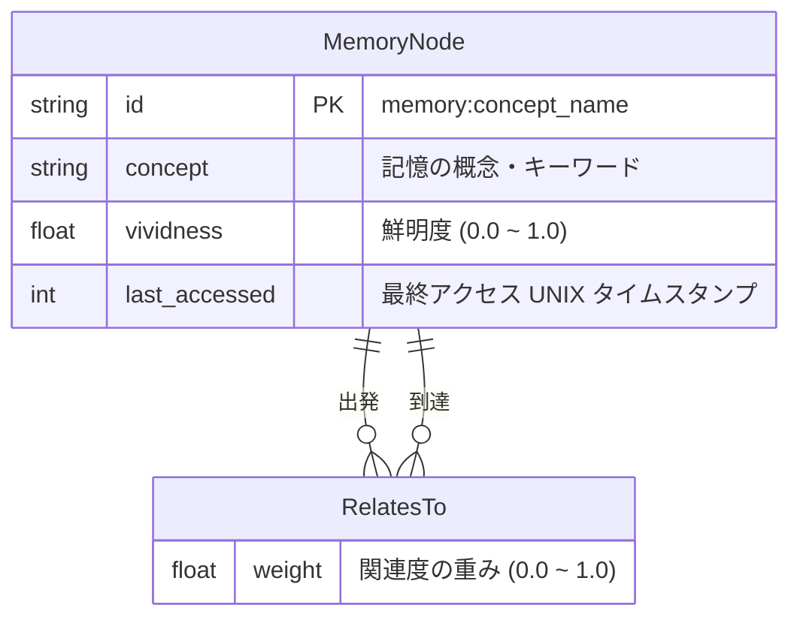

# ER 図: 記憶グラフ スキーマ

## 概要
SurrealDB 上で管理される記憶ノードと、その関係性（エッジ）のスキーマを示します。

## 図

## 備考
- `vividness` はエビングハウス忘却曲線 $V = e^{-t/S}$ に基づき時間とともに減衰する。
- `spread_activation` により、アクセスされたノードの隣接ノードが 0.1 ずつ加算される。

## 更新履歴
| 日付 | 変更内容 |
|---|---|
| 2026-03-24 | 初版作成 |
