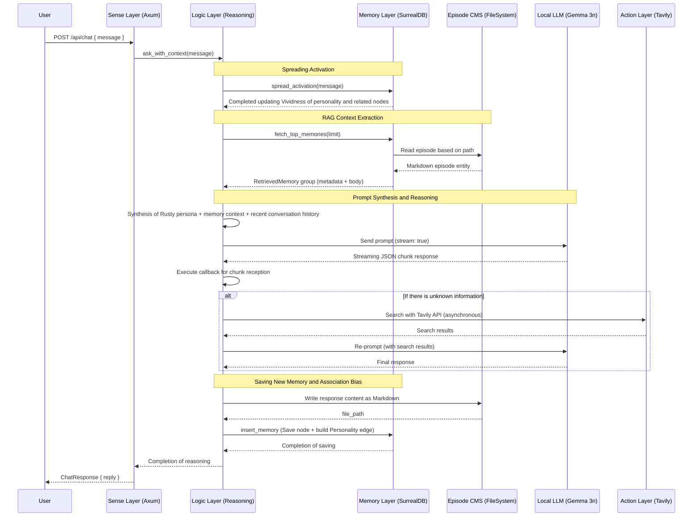

# Sequence Diagram: Chat Endpoint Flow

## Overview
Shows the processing flow of Sense -> Memory -> Logic -> Action at the `POST /api/chat` endpoint.
Reflects the hybrid storage (CMS) design and Spreading Activation from README 2.4.

## Diagram

## Correspondence with Implementation Files
| Participant in Diagram | Source File |
|---|---|
| Sense Layer (Axum) | `src/sense/server.rs` |
| Memory Layer (SurrealDB) | `src/memory/graph.rs` |
| Logic Layer (Ollama) | `src/logic/reasoning.rs` |
| Action Layer (Tavily) | `src/action/research.rs` |

## Update History
| Date | Changes |
|---|---|
| 2026-03-24 | Initial version created |
| 2026-03-24 | Added CMS architecture (FileSystem), Spreading Activation, and implementation correspondence table |
