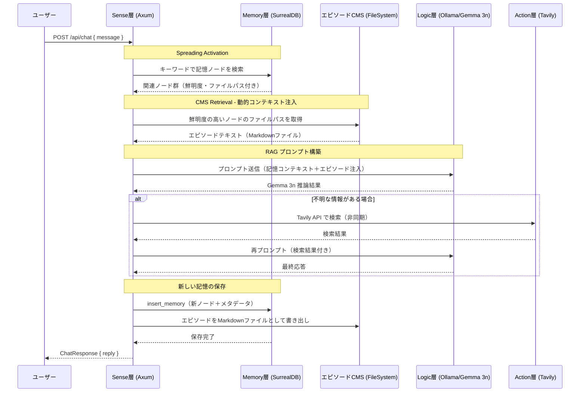

# シーケンス図: チャットエンドポイント フロー

## 概要
`POST /api/chat` エンドポイントにおける、Sense → Memory → Logic → Action の処理フローを示します。
README 2.4 のハイブリッド・ストレージ（CMS）設計および Spreading Activation を反映しています。

## 図

## 実装ファイルとの対応
| 図中の参加者 | ソースファイル |
|---|---|
| Sense層 (Axum) | `src/sense/server.rs` |
| Memory層 (SurrealDB) | `src/memory/graph.rs` |
| Logic層 (Ollama) | `src/logic/reasoning.rs` |
| Action層 (Tavily) | `src/action/research.rs` |

## 更新履歴
| 日付 | 変更内容 |
|---|---|
| 2026-03-24 | 初版作成 |
| 2026-03-24 | CMSアーキテクチャ（FileSystem）・Spreading Activation・実装対応表を追加 |
