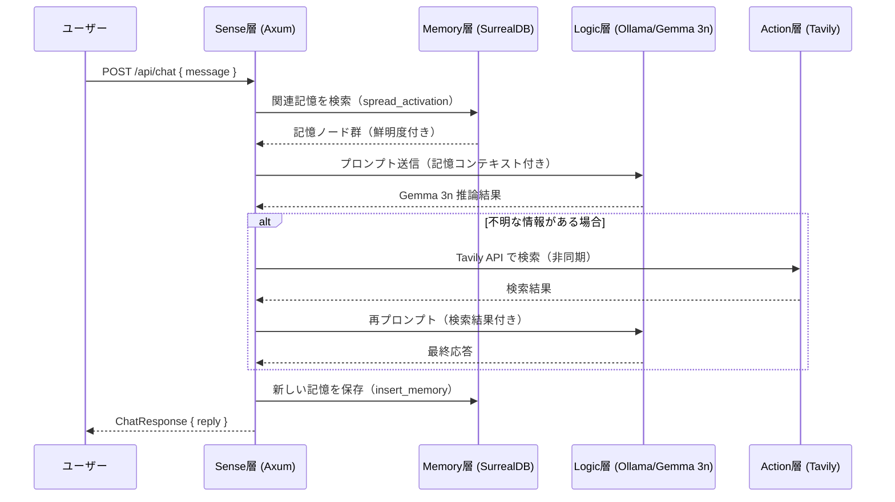

# シーケンス図: チャットエンドポイント フロー

## 概要
`POST /api/chat` エンドポイントにおける、Sense → Memory → Logic → Action の処理フローを示します。

## 図

```mermaid
sequenceDiagram
    participant User as ユーザー
    participant Axum as Sense層 (Axum)
    participant Memory as Memory層 (SurrealDB)
    participant Logic as Logic層 (Ollama/Gemma 3n)
    participant Action as Action層 (Tavily)

    User->>Axum: POST /api/chat { message }

    Axum->>Memory: 関連記憶を検索（spread_activation）
    Memory-->>Axum: 記憶ノード群（鮮明度付き）

    Axum->>Logic: プロンプト送信（記憶コンテキスト付き）
    Logic-->>Axum: Gemma 3n 推論結果

    alt 不明な情報がある場合
        Axum->>Action: Tavily API で検索（非同期）
        Action-->>Axum: 検索結果
        Axum->>Logic: 再プロンプト（検索結果付き）
        Logic-->>Axum: 最終応答
    end

    Axum->>Memory: 新しい記憶を保存（insert_memory）
    Axum-->>User: ChatResponse { reply }
```

## 更新履歴
| 日付 | 変更内容 |
|---|---|
| 2026-03-24 | 初版作成 |
