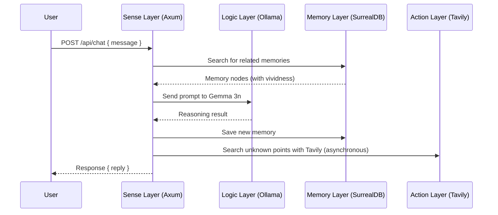
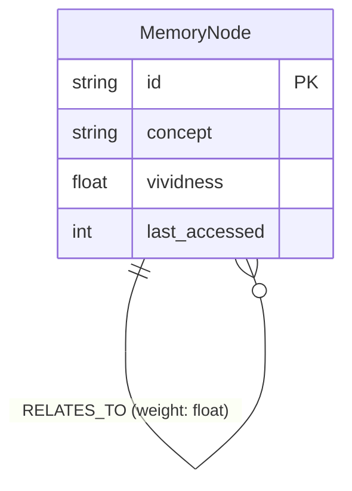

# Documentation Guidelines: Project I.R.I.S.

This file defines the types, formats, and naming conventions for documents created under `.gemini/docs/`.

---

## 🔑 Core Principle: "Create Based on Reality"

> [!IMPORTANT]
> **All documents, diagrams, and specifications must accurately reflect the code that has actually been implemented.**

- **❌ Prohibited**: Documenting features planned for future implementation or endpoints that do not yet exist.
- **✅ Recommended**: Create documents after confirming the completion of implementation by reading the code.
- **⏱ Timing**: Create documents **immediately** after implementation. "Writing everything later" is prohibited.
- **🔍 Verification of Accuracy**: Before creating diagrams or specifications, always read the code under `src/` and verify the actual structure, signature, and flow.
- **🔄 Detection of Divergence**: If you find a divergence between the contents of the documentation and the actual code, update the documentation immediately (code is primary, documentation is secondary).

---

## 📁 Directory Structure Rules

```
.gemini/docs/
├── architecture.md           # Overall system architecture (Required)
├── diagrams/                 # Group of documents including Mermaid diagrams
│   ├── sequence_*.md         # Sequence diagrams (API/processing flow)
│   ├── class_*.md            # Class/Data structure diagrams
│   ├── flowchart_*.md        # Flowcharts (Decision logic, etc.)
│   └── er_*.md               # Entity Relationship diagrams (DB schema, etc.)
└── api/                      # OpenAPI specifications
    └── openapi.yaml          # OpenAPI 3.1 specification (Main)
```

---

## 📊 Mermaid Diagram Creation Rules

### Basic Policy
- **When a new API endpoint or processing flow is implemented, always create a corresponding sequence diagram.**
- **Update the ER diagram when the DB schema changes.**
- All diagrams are saved as Markdown files under `.gemini/docs/diagrams/`.

### Sequence Diagram (Example: `/api/chat` flow)

````markdown

````

### ER Diagram (Example: Memory Graph)

````markdown

````

### Naming Conventions
| Type of Diagram | Filename Prefix | Example |
|---|---|---|
| Sequence Diagram | `sequence_` | `sequence_chat_flow.md` |
| Class Diagram | `class_` | `class_memory_node.md` |
| Flowchart | `flowchart_` | `flowchart_activation.md` |
| ER Diagram | `er_` | `er_memory_graph.md` |

---

## 📋 OpenAPI Specification Creation Rules

### Basic Policy
- **When a new route is added to Axum, always update `api/openapi.yaml`.**
- Describe the specification in **OpenAPI 3.1** format.
- Write all `summary` / `description` in **English** (Note: Original rule said Japanese, but we are translating to English as requested).
- Always define request/response schemas in `components/schemas` and reference them with `$ref`.

### Template

```yaml
openapi: 3.1.0
info:
  title: Project I.R.I.S. API
  description: |
    Backend API specification for I.R.I.S. (Ingenious Rusty Intelligent System).
    Communication interface with the autonomous AI partner running on Raspberry Pi 5.
  version: 0.1.0

servers:
  - url: http://localhost:3000
    description: Local development environment

paths:
  /health:
    get:
      summary: Health check
      description: Check the server's operational status.
      responses:
        '200':
          description: Running
          content:
            text/plain:
              schema:
                type: string

  /api/chat:
    post:
      summary: Chat endpoint
      description: Receives a message from the user and returns I.R.I.S.'s response.
      requestBody:
        required: true
        content:
          application/json:
            schema:
              $ref: '#/components/schemas/ChatRequest'
      responses:
        '200':
          description: Successful response
          content:
            application/json:
              schema:
                $ref: '#/components/schemas/ChatResponse'

components:
  schemas:
    ChatRequest:
      type: object
      required: [message]
      properties:
        message:
          type: string
          description: Message from the user
          example: "Tell me the weather today"

    ChatResponse:
      type: object
      properties:
        reply:
          type: string
          description: Response text from I.R.I.S.
          example: "My circuits are a bit rusty... but it's forecast to be sunny today!"
```

---

## ✅ Documentation Update Checklist

Verify the following before submitting a PR for implementation work:

- [ ] Updated `openapi.yaml` for new API endpoints
- [ ] Created sequence diagrams for new processing flows
- [ ] Updated ER diagrams for DB schema changes
- [ ] Updated `architecture.md` if there is an impact
