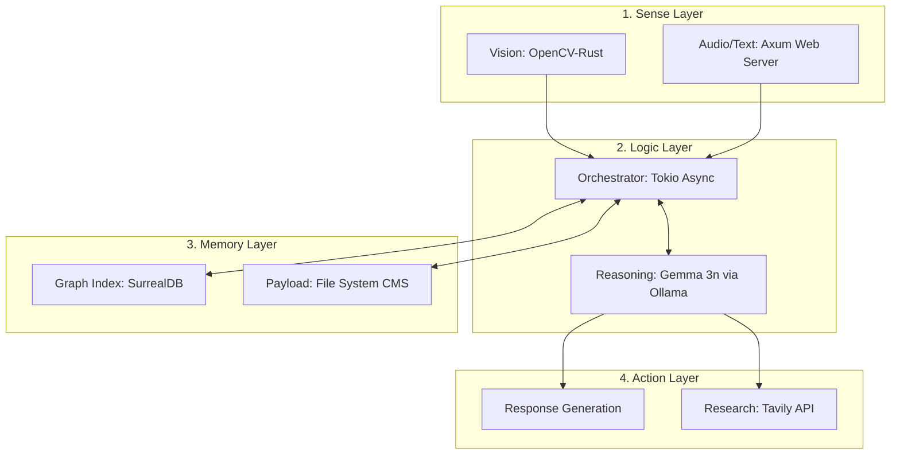

# 🌈 Project I.R.I.S.

> **"Ingenious Rusty Intelligent System"**
> —— 天才的で、錆びついた（洗練された）、知能システム。

[](https://www.rust-lang.org/)
[](https://www.raspberrypi.com/)
[](https://surrealdb.com/)
[](https://ollama.com/)
[](https://www.docker.com/)

**Project I.R.I.S.（アイリス）** は、Raspberry Pi 5 (16GB) を基盤に、Rust言語と最先端LLM「Gemma 3n」を高度に融合させた、自律型・連想記憶AIパートナーです。

---

## 📖 1. コンセプト： "Rusty" の哲学

本システムにおいて「Rusty（錆びている）」は、相反する二つの概念を統合した、エンジニアリング上の「粋（いき）」を象徴しています。

* **究極の洗練 (Refined)**: **Rust言語**による構築。メモリ安全性を担保しつつ、1msの遅延も許さない「磨き上げられたコード」を、逆説的に「錆」と表現しています。
* **人間的な愛嬌 (Humanity)**: 完璧で冷徹なAIではなく、時として「回路が少しサビついていて……」とトボけるような、親しみやすくユーモアのある人格。
* **経年変化の美学**: ユーザーと共に過ごした時間（記憶）が、アンティークの錆のように積み重なり、唯一無二の個性を形成します。

---

## 🛠 2. テクニカル・レポート：システム詳細設計

### 2.1 アーキテクチャ・スタック

I.R.I.S. は、以下の4つの主要レイヤーで構成される多層構造を採用しています。



### 2.2 記憶と人格のグラフ・ネットワーク・モデル（生物的感覚の実装）

I.R.I.S. の頭脳と記憶は、SurrealDBのグラフ構造を用いて「生物の脳（シナプス）」を模倣して設計されています。単なるデータの保存ではなく、「人格」や「時間の感覚」そのものをネットワークの重みと関係性で表現します。

* **時間の感覚（記憶の風化と定着）**:
  エビングハウスの忘却曲線に基づき、動的な「鮮明度（Vividness）」を計算します。SurrealDBのエッジ（関係性）に `last_accessed`（最後に思い出した時間）を記録し、現在時刻との差分から記憶の風化をシミュレートします。定期的にアクセスされる記憶は定着し、放置された記憶は「錆びついて」いきます。
  $$V = e^{-\frac{t}{S}}$$
  * $V$: 記憶の保持率（鮮明度）
  * $t$: 最後に想起してからの経過時間
  * $S$: 記憶の強度（感情スコアや重要度による初期値）

* **連想想起 (Spreading Activation) [コア・メカニズム]**:
  ある単語が会話に登場すると、グラフDB上の隣接するノードに活性化信号が伝播し、周辺の記憶も同時にリフレッシュされます。単純なベクトル検索とは異なり、これにより「そういえば、あれについても……」という人間らしい文脈の飛躍と自律的な連想が可能になります。

* **人格（思考のバイアス）の形成**:
  グラフ上に「ユーモア」「皮肉」「Rustへの愛」といった「人格コア・ノード」を配置します。これらのノードに対するエッジの初期重みを高く設定しておくことで、連想想起の際に自然と思考がその方向に引っ張られます。これにより、Gemma 3nが生成する回答に、一貫した「Rusty」なバイアス（＝人格）がかかります。

### 2.3 視覚システム：主人の個体識別

OpenCV-Rust を利用し、カメラから取得した映像から主人の顔をリアルタイムで検知します。

* **顔認識ロジック**: 特徴量抽出によるローカル認識。プライバシー保護のため、画像データは一切クラウドへ送信されません。
* **プレゼンス・アウェアネス**: 主人の顔を検知した瞬間、記憶グラフ内の「主人に関連するノード」に重みが加算され、会話トーンがパーソナライズされます。

### 2.4 エピソード記憶のハイブリッド・ストレージ構造（CMSアーキテクチャ）

I.R.I.S. との対話や日々の出来事（エピソード記憶）は、Gemma 3n (Ollama) のKVキャッシュ（コンテキストウィンドウ）の制限を突破するため、グラフDBとファイルシステムを組み合わせたCMSライクな構造で管理されます。

1. **Payload (File System)**:
   具体的なエピソードテキストや視覚情報の実体は、日時ベースのディレクトリ階層（例: `/var/iris/memories/YYYY/MM/DD/episode_001.md`）にファイルとして直接書き出されます。
2. **Metadata & Relation (SurrealDB)**:
   SurrealDBには重いデータは保存せず、「トピックのタグ」「感情スコア」「ファイルパス（URL）」のみをノードとして記録し、他の記憶と結合します。
3. **Retrieval (コンテキストの動的注入)**:
   連想が発火した際、RustオーケストレーターがSurrealDBから該当するファイルパスを取得し、必要なエピソードだけを読み込んでOllamaのプロンプトに動的に注入します。

---

## ✨ 3. 主要機能

* **🧠 自律型連想記憶**: グラフ構造で繋がり、時間と共に薄れ、対話で深まる記憶。
* **👁 視覚的パートナーシップ**: 部屋に主人が戻ったことを察知し、表情や状況を理解する。
* **🛰 自律リサーチ**: 分からないことは「後で調べておきますね」と勝手に検索し、知識を拡張する。
* **📊 知能管理ダッシュボード**: 記憶のネットワークを可視化。どの記憶が「錆び（風化）」ているかを確認可能。

---

## ⚙️ 4. 開発者向けセットアップ (Docker Environment)

I.R.I.S. の開発・実行環境は、ホストOSをクリーンに保ち、複雑な依存関係（OpenCV, SurrealDB, Ollama等）の構築を簡略化するため、**Dockerコンテナによる隔離環境**を標準としています。

### 4.1 ハードウェア要件
* **Main**: Raspberry Pi 5 (16GB RAM)
* **Storage**: NVMe SSD (読み書き速度向上のため必須)
* **Camera**: Raspberry Pi Camera Module 3 (または互換性のあるUSBカメラ)

### 4.2 ソフトウェア要件
本プロジェクトはDockerコンテナ上で動作するため、ローカル環境にRustやデータベースを直接インストールする必要はありません。ホストOS（Raspberry Pi OS 64-bit 等）には、以下のツールのみインストールしてください。

* **Git**: ソースコードの取得用
* **[Docker Engine](https://docs.docker.com/engine/install/)**
* **[Docker Compose](https://docs.docker.com/compose/install/)** (v2系)

### 4.3 コンテナ・アーキテクチャ (Dev / Release 分離)
本プロジェクトは、開発時の利便性（Windows等への対応・ホットリロード）と、本番稼働時（Raspberry Pi 5・カメラデバイス連携）の要件が異なるため、Docker Composeファイルを分割しています。

1. `docker-compose.yml` (ベース共通設定: ネットワーク・環境変数)
2. `docker-compose.dev.yml` (Windows開発用: ソースコードマウントあり、カメラマウントなし)
3. `docker-compose.release.yml` (本番用: カメラマウントあり、軽量ランタイムビルド)

### 4.4 環境構築と起動ステップ

1. **リポジトリのクローンと環境変数設定**
   ```bash
   git clone [https://github.com/yourusername/project-iris.git](https://github.com/yourusername/project-iris.git)
   cd project-iris
   cp .env.example .env
   ```

2. **Ollama コンテナの事前準備（Gemma 3n モデルのプル）**
   初回のみ、Ollamaコンテナを立ち上げてモデルをダウンロードしておきます。
   ```bash
   docker compose up -d ollama
   docker compose exec ollama ollama run gemma3n
   # プロンプトが立ち上がったら /bye で抜けます
   ```

3. **システムのビルドと起動**
   環境に合わせて以下のコマンドで起動します。

   * **Windows等での開発時 (Dev)**
     ```bash
     docker compose -f docker-compose.yml -f docker-compose.dev.yml up -d --build
     ```
   * **Raspberry Pi 5 での実機稼働時 (Release)**
     ```bash
     docker compose -f docker-compose.yml -f docker-compose.release.yml up -d --build
     ```

4. **ログの確認と停止**
   ```bash
   docker compose logs -f iris-core  # ログのリアルタイム監視
   docker compose down               # システムの安全な停止
   ```

---

## ⚠️ 5. 既知の課題と技術的な実装想定 (Edge AI Constraints)

Raspberry Pi 5というエッジデバイス上で大規模言語モデルとグラフDBを共存させるため、本プロジェクトでは以下のハードウェア・ソフトウェア制約を前提とした実装を行います。

* **5.1 ストレージの摩耗問題と NVMe SSD**
  SurrealDBの動的なデータ更新やLLMのオンメモリ展開によるSDカードの書き込み上限（TBW）到達を防ぐため、PCIe 2.0 インターフェースを活用した **NVMe SSD を必須** とします。
* **5.2 メモリ制約（16GB RAM）と LLMの量子化**
  OOM（Out of Memory）を防ぐため、Ollamaの機能を活用し、Gemma 3nを **4-bit または 8-bit 量子化 (Q4_K_M など)** してロードし、他プロセス用のメモリマージンを確保します。
* **5.3 排熱・電源管理**
  SoCの高負荷によるサーマルスロットリングやシステムダウンを防ぐため、純正の **27W USB-C 電源 (5V/5A)** と **Active Cooler** の装着を前提とします。
* **5.4 Rust 非同期処理設計によるスレッド枯渇の防止**
  OpenCVの重い画像処理やAPI通信がメインスレッドをブロックしないよう、Rustの `Tokio` ランタイムを活用し、`tokio::task::spawn_blocking` を用いてタスクを厳密に分離します。

---

## 📅 6. ロードマップ

- [ ] システムアーキテクチャの基本設計
- [ ] エピソード記憶のハイブリッド・ストレージ構造（CMS設計）の策定
- [ ] Dockerによるコンテナ化・開発環境の分離
- [ ] **グラフベースの連想想起ロジックの実装（SurrealDB + Rust）**
- [ ] **Rust による Ollama API クライアントの実装**
- [ ] **カメラ接続と OpenCV による顔認識パイプラインの実装**
- [ ] 記憶管理ダッシュボード (Leptos) の構築
- [ ] 音声合成（TTS）への感情パラメータの実装

---

## 📜 7. ライセンス

MIT License